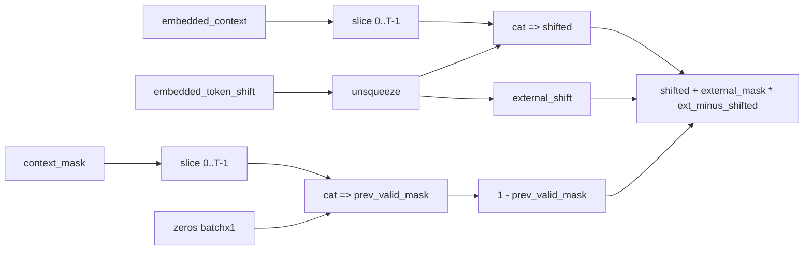

# Token Shift Analysis

Date: 2026-03-15
Repo: `/home/asturian/rwkv-rs`
Focus: `crates/rwkv-nn/src/functions/token_shift.rs`

## Why This File Was Investigated

Tracy results showed that:

- `rwkv.infer.model.weight_prepare.token_shift_diff` is one of the most expensive sub-stages in TMix.

That makes `token_shift.rs` a first-priority implementation hotspot.

Primary file:

- `/home/asturian/rwkv-rs/crates/rwkv-nn/src/functions/token_shift.rs`

Relevant call sites:

- `/home/asturian/rwkv-rs/crates/rwkv-nn/src/modules/time_mixer/weight_prepare.rs`
- `/home/asturian/rwkv-rs/crates/rwkv-nn/src/modules/channel_mixer/mod.rs`

## Current Logic

The current `token_shift()` behavior is:

1. If `context_length == 0`, return input unchanged.
2. If no external shift state exists, allocate a zero tensor.
3. If `context_length == 1`, return the external shift directly.
4. Otherwise build a shifted tensor:
   - `[embedded_token_shift, embedded_context[:, 0..T-1]]`
5. If no `context_mask`, return this shifted tensor.
6. If `context_mask` exists:
   - build `prev_valid_mask = [0, context_mask[:, 0..T-1]]`
   - compute `use_external_shift = 1 - prev_valid_mask`
   - blend `shifted` with `external_shift` on invalid previous steps

## Structural Cost Drivers

This implementation is not a lightweight view-only path.
It is a chain of real tensor operations.

Main reasons:

1. `Tensor::cat` is used twice
   - once for `shifted`
   - once for `prev_valid_mask`

2. Multiple intermediate tensors are materialized
   - `embedded_token_shift.unsqueeze_dim(1)`
   - `embedded_context.slice(...)`
   - `prev_valid_mask`
   - `use_external_shift`
   - `external_shift`

3. Final masked blend is another multi-op tensor chain

```text
shifted + use_external_shift * (external_shift - shifted)
```

This implies at least:

- one subtraction
- one multiplication
- one addition
- one or more broadcasts / unsqueezes

4. The mask path is significantly heavier than the no-mask path

That matches the observed Tracy result, because inference prefill commonly runs with `context_mask`.

## Dataflow Sketch



## Important Secondary Finding

There is repeated downstream work after `token_shift`.

In both TMix and CMix, the pattern is:

1. call `token_shift(...)`
2. compute `prev - embedded_context`
3. apply mask again to the diff

This occurs in:

- `weight_prepare.forward()`
- `channel_mixer.forward()`

That means the effective cost is not just `token_shift()` itself.
It is `token_shift + diff + mask`, and the same shape of work appears in more than one place.

## Why This Is Likely Expensive In Practice

Given the current inference shape, the likely performance problems are:

1. Too many small/medium tensor ops
2. Repeated materialization instead of fused logic
3. Broadcast-heavy masked blending
4. Repeated mask handling outside and inside this function
5. Prefill magnifies this because the cost scales with context length

## Immediate Optimization Candidates

### 1. Split decode and prefill paths more aggressively

The `context_length == 1` fast path already exists.
That is good.

But for long prefill, the generic path is still expensive.
It may be worth introducing a dedicated prefill implementation that minimizes temporary tensors.

### 2. Avoid double `cat`

Current implementation constructs:

- shifted sequence
- shifted previous-valid mask

This is a strong candidate for optimization.
If either can be derived through indexing/select logic or a fused kernel, cost should drop.

### 3. Push mask logic into a more specialized implementation

The expensive branch is specifically the left-padding-safe branch:

- build `prev_valid_mask`
- derive `use_external_shift`
- blend with `external_shift`

This logic is correct, but expensive in generic tensor algebra form.

A specialized kernel or more direct implementation could reduce:

- temporary tensors
- broadcast chains
- elementwise launch count

### 4. Reconsider function boundary

Right now callers do:

- `prev = token_shift(...)`
- `token_shifted_diff = prev - embedded_context`
- apply mask again

It may be better to expose a function that directly returns:

- `prev`
- or even directly `token_shifted_diff`

Possible API option:

```text
token_shift_with_diff(...)
  -> { shifted_prev, token_shifted_diff }
```

or, if only diff is needed:

```text
token_shift_diff(...)
```

That could remove repeated subtraction/masking work in callers.

### 5. Investigate CMix and TMix duplication

`token_shift`-derived work exists in both:

- TMix `weight_prepare`
- CMix `channel_mixer`

If both paths execute frequently, reducing this shared pattern could have compound benefit.

## Suggested Refactor Directions

### Option A: Return pre-masked diff directly

Best if downstream users mostly care about `prev - current`.

Pros:

- removes repeated caller work
- centralizes mask semantics

Cons:

- slightly changes function responsibility

### Option B: Add a fused kernel for masked shift

Implement:

- previous-token shift
- left-padding handling
- optional diff production

inside one backend kernel

Pros:

- likely best runtime result

Cons:

- higher implementation complexity
- backend-specific work

### Option C: Keep current API, reduce temp tensors

Rewrite the current math to reduce:

- `cat`
- `ones/zeros`
- explicit blend chain

Pros:

- lower engineering risk

Cons:

- may leave substantial performance on the table

## Recommended Next Step

Do not start with a new kernel immediately.

Recommended order:

1. inspect how `token_shift` output is consumed in TMix and CMix
2. redesign the API so callers do not repeat `diff + mask`
3. only then decide whether a fused kernel is necessary

This is the most pragmatic path because the current hotspot appears to come from both:

- the internals of `token_shift`
- redundant follow-up work in callers

## Preliminary Recommendation

Most likely best next implementation experiment:

1. introduce a `token_shift_diff(...)` helper that directly returns masked diff
2. use it in:
   - `weight_prepare`
   - `channel_mixer`
3. profile again before writing a dedicated fused kernel

If the hotspot remains dominant after that, then move to a fused implementation.
